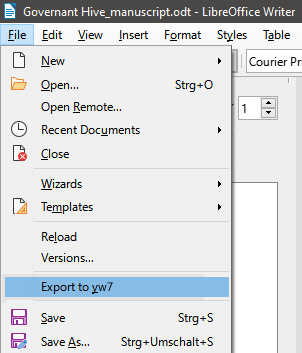

This is a lightweight variant of the [yw-cnv](https://peter88213.github.io/yw-cnv) extension,  providing export to the yw7 file format only. It is primarily intended as a complement to [novelyst](https://peter88213.github.io/novelyst), for writing ODF documents back to the yw7 file format. 

## Features

- Synchronize a yw7 project from a rewritable OpenDocument file, such as a manuscript, proofing document, several description documents, or spreadsheets, created by [novelyst](https://peter88213.github.io/novelyst) or [yW2OO](https://peter88213.github.io/yW2OO).
- Generate a new yw7 project file from a **work in progress** or an **outline** .
- The extension is ready for internationalization with GNU gettext. A German localization with help pages in German is provided.

You can find more information on the [help pages](help).

## Requirements

- [LibreOffice](https://www.libreoffice.org/) version 5.4 or more recent. LibreOffice 7 is highly recommended.
- Java Runtime Environment (LibreOffice might need it for macro execution).

**Please note:** *This extension can not be installed on OpenOffice. An OpenOffice variant can be found [here]( https://peter88213.github.io/oo2yw7).*

## Download and install {#download}

[Download the latest release (version 1.0.1)](https://raw.githubusercontent.com/peter88213/lo2yw7/main/dist/lo2yw7-L-1.0.1.oxt)

- Installation right at download, by double-clicking on the downloaded 
 file, or via the LibreOffice Extension Manager. Instructions can be found [here](https://wiki.documentfoundation.org/Documentation/HowTo/install_extension).
- After installation (and Office restart) you find a new "yWriter Import/Export" submenu in the "Files" menu.
- If no additional "yWriter Import/Export" submenu shows up in the "Files" menu, please look at the "Tools" > "Extensions" menu.
- On Linux (especially Ubuntu), make sure that the *libreoffice-script-provider-python* package is installed.

[Changelog](changelog)

## Get updates

This extension supports the update mechanism of LibreOffice. You can let the Extension Manager check for updates from time to time to get the latest release.

## Credits

[OpenOffice Extension
Compiler](https://wiki.openoffice.org/wiki/Extensions_Packager#Extension_Compiler)
by Bernard Marcelly.

Frederik Lundh published the [xml pretty print algorithm](http://effbot.org/zone/element-lib.htm#prettyprint).

Andrew D. Pitonyak published useful Macro code examples in [OpenOffice.org Macros Explained](https://www.pitonyak.org/OOME_3_0.pdf).

## License

This extension is distributed under the [MIT
License](http://www.opensource.org/licenses/mit-license.php).

## See also

### The "curly" extensions for OpenOffice and LibreOffice
"Curly quotes" conversion.

### The StyleSwitcher extension for OpenOffice and LibreOffice
A style switcher extension.

